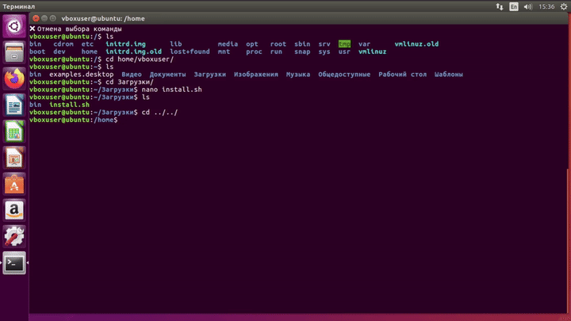

# rh-history

📜 Terminal command launcher with directory context — an enhanced Reverse-i-search.

It saves each executed command along with the working directory to a log file `~/.rh_history`. Later, you can interactively filter, search, and re-run those commands via `rh`.

For example, if you opened a file in `mcedit` (via Midnight Commander), you can later re-launch it with `nano` directly from history.



---

## Features

* Logs every command with the working directory.
* Filters out unimportant commands (`cd`, `clear`, `exit`, etc.).
* Interactive fuzzy search via [skim](https://github.com/lotabout/skim).
* Seamless shell integration (`bash`, `zsh`).

---

## Components Overview

### `mcedit` (in `bin/`)

A wrapper around the `nano` editor that:

* Logs the editor invocation via `rh-log.sh`;
* Then launches the actual editor (`nano` by default — check path in `~/bin/mcedit`).

Used as the default `$EDITOR`.

```bash
#!/bin/bash
rh-log.sh "mcedit $1"
exec /usr/bin/nano "$@"
```

---

### `rh-log.sh` (in `bin/`)

A minimal `bash` logger, used via `PROMPT_COMMAND`.

* Trims leading/trailing spaces;
* Filters out commands like `cd`, `clear`, `history`, `exit`, etc.;
* Appends command + working directory to `~/.rh_history`.

---

### `rh` (binary)

A command-line utility written in Rust using [`skim`](https://github.com/lotabout/skim).

Allows:

* Browsing your logged command history;
* Selecting a command to execute;
* Re-executing it in the original directory.

---

## Installation

### 1. Requirements

* [Rust toolchain](https://rustup.rs/)
* [skim](https://github.com/lotabout/skim)

---

### 2. Run the installer:

```bash
git clone https://github.com/s1vv/rh-history.git
cd rh-history
./install.sh
```

The script:

* Copies `mcedit`, `rh-log.sh`, `rh` to `~/bin`;
* Updates `~/.bashrc` or `~/.zshrc` with:

```bash
export PATH="$HOME/bin:$PATH"
export EDITOR=mcedit
export PROMPT_COMMAND='history -a; rh-log.sh "$(fc -ln -1)"'
```

---

## Usage

1. **Use your shell as usual.**
2. **Your command history gets logged automatically.**
3. **To search and run a past command:**

```bash
rh
```

An interactive fuzzy menu opens. Select the command — it will be executed in its original directory.

---

```bash
rh -h
```

Displays the last 9 logged commands.

---

```bash
rh -r 4
```

Replays command #4 from the history.

---

## Tips

* Make sure `~/bin` is in your `$PATH`.
* If you prefer another editor, edit `mcedit` to use it instead of `nano`.

---

## License

MIT — feel free to use, modify, and redistribute. See `LICENSE`.

---

## Other languages

🌐 Looking for the Russian version?
Check the [`ru-lang` branch](https://github.com/s1vv/rh-history/tree/ru-lang)

---
